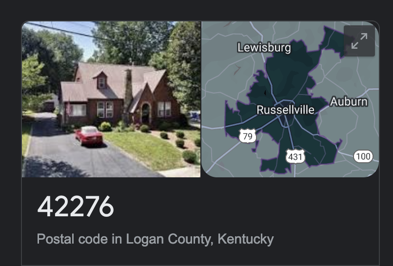
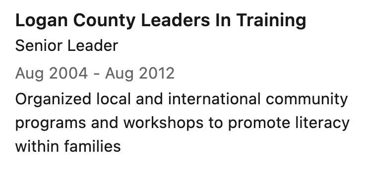
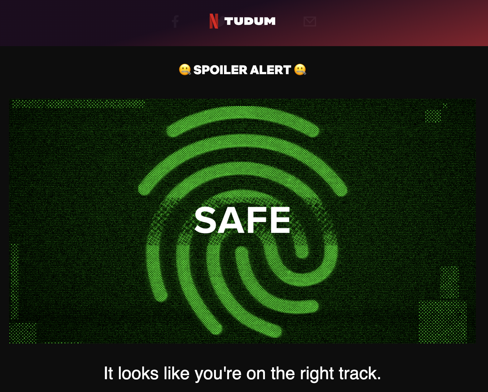

# i’m like 99% sure i know who _The Mole_ is

There’s a new season of _The Mole_ on Netflix and it rocks. It’s got everything you want from a _The Mole_: convoluted challenges forcing people to betray each other, an impish cable TV host who pops up to say look at these freaks! 10 times an episode, impossible puzzles that you watch and are like oh, I would solve that no sweat even though you definitely would not. Episodes were released in batches of 5 and 3 over the last couple of weeks, and the last 2 are out this Friday.

A really cool and stupid thing about _The Mole_ is each episode has a hidden clue, for the audience, as to The Mole’s identity. Historically speaking, these clues suck. There are two that I remember. One is, in the season premiere of the first season, The Mole arrived fourth — and “mole” has four letters (Anderson Cooper literally explained this on national TV). The second clue was, in one of the second-season episodes, no stars were visible at night, except for one shot where they digitally added The Mole’s astrological sign.

The clues are dumb, and with the Netflix batch, I tried very hard to not look for them. A seemingly random string of letters and numbers on the side of a treasure chest? PASS. I honestly don’t know if they’re even putting clues in the reboot episodes. But I think I found one. From episode 5, where there’s a very real block of C4 on a table:

The batch number on this fake C4 is 42276. I didn’t even have to pause the episode to catch this. That’s five digits, so I thought to myself “I wonder what zip code that is.” If this were the early 2000s, when _The Mole_ originally aired, I’d ignore this impulse and move on with my life.

Unfortunately, we’ve got internet all the time now, so I plugged “42276” into Google and got this.

Woohoo. Again, if this were the early 2000s, I’d give up. But because every Netflix Original is grist for the content mill, it is very easy to type something like “the mole 2022 cast” into Google and get a lot of information from a bunch of real sites that look like fake sites from Law & Order. Like this article from [Reality Titbit](https://www.realitytitbit.com/netflix-reality-shows/meet-netflixs-the-mole-2022-contestants-from-avori-henderson-to-casey-lary), which tells me that contestant Kesi Neblett “grew up with four brothers and sisters in the backcountry of Kentucky.”

That’s pretty close, but maybe that’s a coincidence. Can we go deeper? Yes, because though LinkedIn didn’t exist when the original _The Mole_ aired in 2001 and 2002, it sure as hell exists now. Let’s check out [Kesi’s LinkedIn page](https://www.linkedin.com/in/charvinia-kesi-neblett-751a78b7/), specifically what’s in the Organizations section of her profile.

Wow, that’s sooooo interesting! What an odd coincidence! The C4 brick had the zip code of Logan County on it, and Kesi — who has been messing up in challenges constantly but sorta believably — used to live in Logan County? What are the odds?

I went to Netflix’s first-party content mill, Tudum, and took their online version of the elimination quiz contestants take each episode, armed with this knowledge.

I sure hope ubiquitous, instant internet access hasn’t ruined the new _The Mole_ for me!!!!!!
